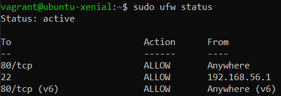
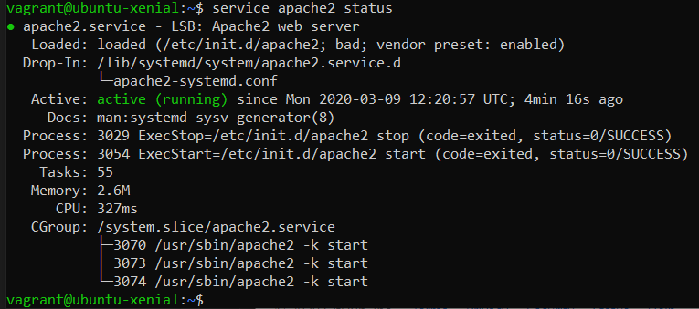

# Lernbeurteilung 02

## Bewertung
[Bewertungsraster](https://bscw.tbz.ch/bscw/bscw.cgi/31406128?op=preview&back_url=23235391%3fclient_size%3d439x412)

## Umsetzung
### Wichtig
ll /
cd /vangrant_data/

### Netzwerkplan

### Sicherheitsaspekte

#### Firewall & Rules
Hier sieht man die erstellten Firewall Rules. Hierbei habe ich denn Zugriff per SSH nur auf meinen eigenen Client beschränkt.

#### Proxy / Reverse Proxy

##### Proxy
Ein Proxy ins eine Kommunikationsschnittstelle in einem Netzwerk. Er arbeitet als Vermittler, der auf einer Seite Anfragen aufnimmt, um dann über eine eigene Adresse eine Verbindung zur gewünschten Seite herzustellen.

##### Reverse Proxy
Der Reverse-Proxy holt Ressourcen für einen Client aus dem Netzwerk. Dabei wird die wahre Adresse des internet systems dem externen System nicht zugänglich gemacht.

###### Konfiguration 

#### Rechtevergabe

#### SSH-Tunnel

### Testing

[Go back to main Document](https://github.com/Daddey69/Modul_300/blob/master/README.md)
