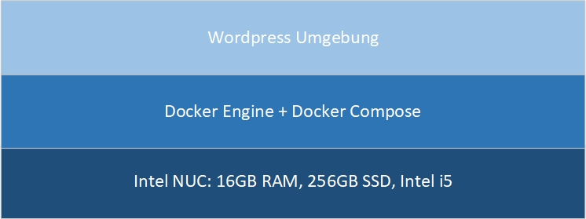
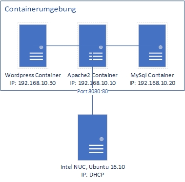

# Wordpress Umgebung

Um diese Umgebung in Betrieb zu nehmen, muss der überordner heruntergeladen werden. Danach muss das Docker Compose File mit dem Befehl `docker compose run -d` ausgeführt werden. Dabei werden die drei ServerContainer aufgestartet.

# Volumes
Wichtig zu beachten bei den Volumes ist, dass der Ordner im Container auf weiteres Leer bleibt solange keine Dokumente im lokalen Verzeichniss liegen, daher ist es wichtig das wirklich nur die untersten Ordner als Volumes angehengt werden, da sonst Probleme bei Installatino wie auch Konfiguration auftretten können.

## Schichtenmodell

## Netzwerkplan

