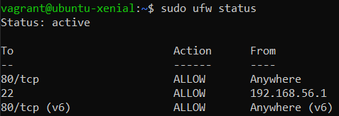
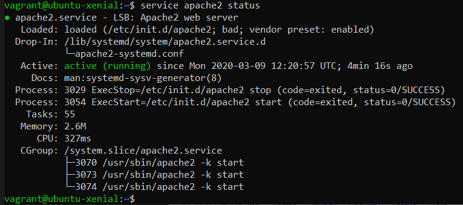
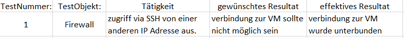

# Security

### Wissenstand
Im Bereich Security, habe ich verhältnissmäsig zur Verantwortung welche ich im allgemeine Berufsaltag trage noch relativ wenig gelernt. Aktuell beschränkt sich mein Wissen noch auf einfache Firewall Rules und Konfigurationen von Clients sowie Subentting.

## Firewall & Rules
Hier sieht man die erstellten Firewall Rules. Hierbei habe ich denn Zugriff per SSH nur auf meinen eigenen Client beschränkt.

## Proxy / Reverse Proxy

### Proxy
Ein Proxy ins eine Kommunikationsschnittstelle in einem Netzwerk. Er arbeitet als Vermittler, der auf einer Seite Anfragen aufnimmt, um dann über eine eigene Adresse eine Verbindung zur gewünschten Seite herzustellen.

### Reverse Proxy
Der Reverse-Proxy holt Ressourcen für einen Client aus dem Netzwerk. Dabei wird die wahre Adresse des internet systems dem externen System nicht zugänglich gemacht.

#### Konfiguration 

## Benutzer & Rechte

| Benutzername  | Funktion                                             |
| ------------- | ---------------------------------------------------- | 
| `root`        | Der Systemadministrator unter Linux                  |
| `nobody`      | Wird von Prozessen als Benutzererkennung verwendet, wenn nur ein Minimum an Rechten vergeben werden soll  |
| `cupsys`      | Benutzer des Druckdienstes CUPS                      |
| `www-data`    | Benutzer des Webservers Apache                       |

Die Benutzer kann man in der Datei `/etc/passwd` finden. zusätzlich werden die Passwörter in der Datei `/etc/shadow` gespeichert.

Der Systemadministrator hat kein Passwort daher ist eine Anmeldung mit diesem Account auch nicht möglich. Falls root berechtigungen für das Ausführen eines befehls nötig sind, so können diese mit dem zusatz von "sudo" genutzt werden.

## SSH-Tunnel

### Testing

[Go back to main Document](https://github.com/Daddey69/Modul_300/blob/master/README.md)
