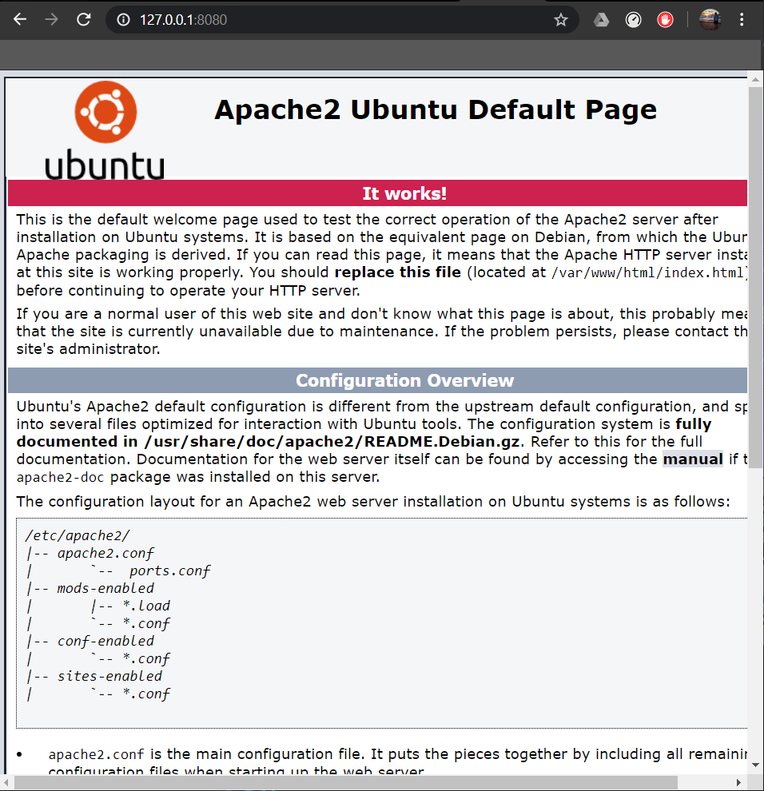
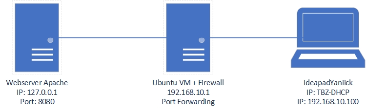

# Vagrant

Vagrant ist eine Software, welche für das automatisierte erstellen von WMs genutzt wird. Vagrantfile lassen sich Konfigurationen an den VMs und Informationen für die Hypervisoren anpassen. Über das CMD, kann vagrant angesprochen werden und somit auch die VMs

Mehr Informationen können unter [Vagrant](https://www.vagrantup.com/) gefunden werden.

## Befehle
* vagrant Init --> Erstellt VM
* vagrant up --> Startet VM
* vagrant ssh --> Verbindet sich per SSH zur VM
* vagrant status --> Zeigt Status der VM an
* vagrant port --> Zeigt weitergeleitete Ports der VM an.
* vagrant halt --> stoppt die VM
* vagrant destroy --> Zerstört / löscht die VM 

## Vagrant VM einrichten
1. zuerst muss ein Ordner erstellt werden.
> mkdir newProject
> cd NewProject
2. Nun muss ein neues Vagrantfile erstellt werden.
> vagrant init ubuntu/xenial64
>
> vagrant up --provider virtualbox
3. Nun läuft die VM diese kann auch über Virtualbox geöffnet werden.
4. Um die VM zu terminieren wird folgender Befehl genutzt.
> vagrant destroy -f

## Funktionstest
Die Funktionalitäten unser VMs können wir testen, indem wir die gehostete Website unseres Apache Webservers aufrufen. Dazu erstellen wir zuerst eine VM.

1. Zuerst nehmen wir das forgefertigte Image aus dem /web Ordner
2. Dieses starten wir auf
> vagrant up
3. Danach öffnen wir den Browser auf unserem Client und schauen ob wir über die ip und den port des Dienstes, die Website aufrufen können.

### Netzwerkplan

[Go back to main Document](https://github.com/Daddey69/Modul_300/blob/master/README.md)