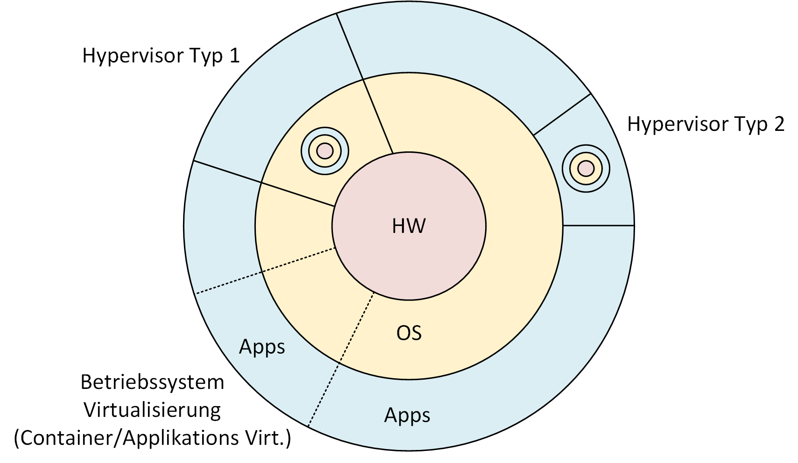

# Virtualisierung

## Befehle

## Wissenstand
Im Bereich der Virtualisierung hat sich mein Wissen bis jetzt nur auf VMWare Workstation und Docker beschränkt, neu kann ich nun auch mit virtual Box umgehen und somit auch mit Vagrant. Bis jetzt habe ich alle VMs von Hand erstellt nun werde ich sicher einige schneller erstellen mit Vagrant sobald ich mit Linux(Ubuntu) arbeiten werde.

### Hypervisor
Wie ich in meinem aktuellen UeK lernen konnte, gibt es bei den Hypervisoren zwei unterschiedliche Versionen. Dabei unterscheidet man zwischen Typ1 und Typ2

#### Typ1
Bei einem Hypervisor des Typ 1 wird alles von der Hardware bis zur Software virtualisiert. Dabei wird der Hypervisor direkt auf der physischen Hardware installiert.

#### Typ2
Bei einem hypervisor des Typ 2 wird der Hypervisor über dem OS installiert. Dies bietet weniger Sicherheit, da weniger Layers zwischen der effektiven Hardware und der VM sind und dadurch ein Ausbruch aus dem COntainer sich wesentlich einfacher gestaltet.

[Go back to main Document](https://github.com/Daddey69/Modul_300/blob/master/README.md)
